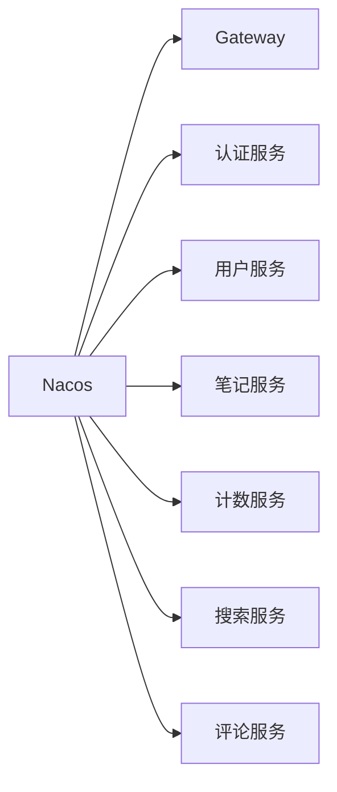

# SmartMine 智矿社区 - 高并发社区平台

[](https://spring.io/projects/spring-cloud-alibaba)
[](https://cassandra.apache.org/)
[](LICENSE)

> 一个面向矿业领域的高性能知识分享社区平台，支持千万级用户并发访问，提供笔记发布、社交互动、内容搜索等核心功能

## 🌟 核心特性

### 🚀 高性能架构
- **10万+ TPS** 分布式ID生成服务（Leaf实现）
- **毫秒级响应** 用户信息查询（Redis+Caffeine二级缓存）
- **5万+/s** 点赞操作处理能力（RoaringBitmap+MQ削峰）

### 🛡️ 高可用设计
- 微服务拆分（12+独立服务）
- Nacos服务注册与配置中心
- 多级容错机制（限流/降级/熔断）

### 📈 高并发解决方案
| 场景          | 技术方案                          | 性能提升       |
|---------------|-----------------------------------|---------------|
| 点赞操作      | RoaringBitmap + MQ异步落库       | 300%          |
| 计数统计      | BufferTrigger聚合写 + 分片广播    | 减少90%DB压力 |
| 评论处理      | 批量消费 + 批量写入               | 400%吞吐量    |
| 关注关系      | Redis ZSET + Lua原子操作          | 毫秒级响应    |

## 🛠️ 技术栈全景

**分布式框架**


**核心组件**
| 类别               | 技术方案                          |
|--------------------|-----------------------------------|
| **微服务框架**     | Spring Cloud Alibaba + Nacos      |
| **API网关**        | Spring Cloud Gateway             |
| **安全认证**       | SaToken + JWT                    |
| **数据存储**       | MySQL + Cassandra + Redis        |
| **消息队列**       | RocketMQ                         |
| **分布式ID**       | 美团Leaf（号段/雪花模式）         |
| **文件存储**       | Minio + 阿里云OSS（策略模式）     |
| **搜索服务**       | Elasticsearch + Logstash + Canal  |
| **任务调度**       | XXL-JOB                          |

## 🏗️ 架构亮点

### 🔑 核心服务设计
1. **分布式ID生成服务**
   - 双模式支持（号段/雪花算法）
   - 单机吞吐量 22,000+/s
   - 日提供19亿+ID生成能力

2. **对象存储服务**
   ```java
   // 策略模式实现多存储支持
   public interface StorageStrategy {
       String upload(File file, FileType type);
   }
   
   @Component("minioStrategy")
   public class MinioStrategy implements StorageStrategy { ... }
   
   @Component("ossStrategy")
   public class OSSStrategy implements StorageStrategy { ... }
   ```

3. **计数服务优化**
   ```mermaid
   sequenceDiagram
       用户->>+计数服务: 关注操作
       计数服务->>MQ: 发送计数事件
       MQ->>消费者: 批量拉取(1000条/批)
       消费者->>BufferTrigger: 流量聚合
       BufferTrigger->>Redis: 增量计数
       BufferTrigger->>DB: 异步落库(削峰)
   ```

### ⚡ 高并发处理
- **点赞系统优化**
  - 咆哮位图(RoaringBitmap)替代布隆过滤器
  - Redis ZSET暂存+MQ异步持久化
  - RateLimiter令牌桶流量控制

- **评论服务设计**
  - 冗余字段避免多表关联
  - Spring Retry+兜底写库保证MQ可靠性
  - 批量消费提升吞吐量（500条/批）

- **缓存策略**
  ```java
  // 用户信息二级缓存
  @Cacheable(cacheNames = "user", key = "#userId", 
             cacheManager = "caffeineRedisCacheManager")
  public User getUserById(Long userId) {
      // DB查询
  }
  
  // 笔记更新时的缓存清理
  @CacheEvict(cacheNames = "note", key = "#noteId")
  public void updateNote(Note note) {
      // 更新操作
      rocketMQTemplate.send("note-update-topic", noteId);
  }
  ```

## 🚀 快速启动

### 前置要求
- JDK 17+
- Docker 20.10+
- MySQL 8.0
- Redis 6.2

### 服务启动
```bash
# 1. 启动基础设施
docker-compose -f infra-docker-compose.yml up -d

# 2. 编译项目
mvn clean package -DskipTests

# 3. 启动网关服务
java -jar smartmine-gateway/target/*.jar

# 4. 启动认证服务
java -jar smartmine-auth/target/*.jar

# 5. 启动其他微服务...
```

## 📊 性能指标

| 接口类型       | 平均响应时间 | QPS    | 99线   |
|---------------|------------|--------|--------|
| 笔记查询       | 23ms       | 12,500 | 56ms   |
| 点赞操作       | 8ms        | 32,000 | 21ms   |
| 关注操作       | 11ms       | 28,500 | 35ms   |
| 评论发布       | 15ms       | 18,200 | 42ms   |
| 用户信息查询   | 5ms        | 45,000 | 12ms   |

*测试环境：8核16G × 3节点，Jmeter 500并发*

## 📚 项目文档

- [架构设计文档](docs/ARCHITECTURE.md)
- [数据库设计](docs/DATABASE.md)
- [部署指南](docs/DEPLOYMENT.md)
- [API接口文档](http://api.smartmine.example/swagger-ui/)

## 🤝 贡献指南
欢迎提交PR！请阅读我们的[贡献指南](CONTRIBUTING.md)开始贡献代码。

## 📄 许可证
本项目采用 [MIT 许可证](LICENSE)。
